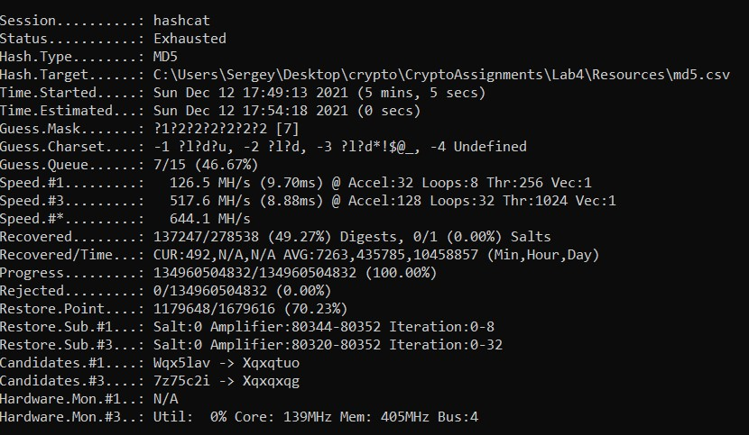
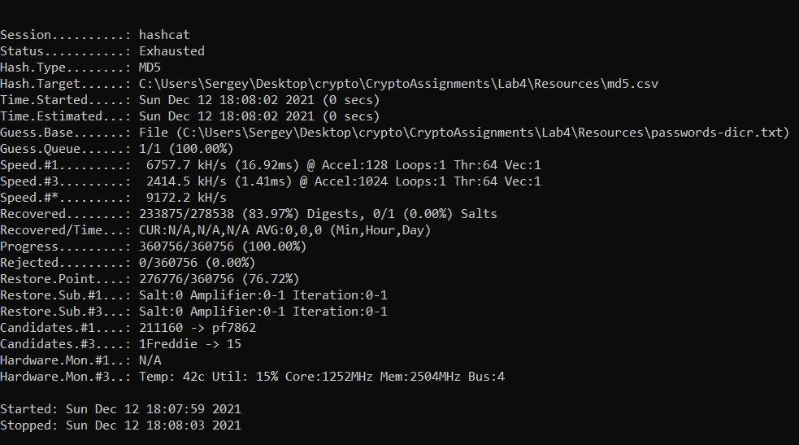

# Lab 4

## Part 1 - Password generating

For this part we've searched for the top 100 passwords, that human often use. 
Also we've found 1 million of commonly used passwords. And also we've generated 50000 random passwords.

Our app then concatenates this 3 lists of passwords into one and 
then encrypt all of them with the help of hashing algorithms (MD5 and SHA256).
In this case we didn't add any salts in these hashing algorithms.

To generate really hard-to-decrypt passwords we use argon2 hashing algorithm
with floating-size salt. The salts are also generate with the 
real random generator from System.Security.Cryptography namespace.

## Part 2 - Password decrypting attack

To do attacks for decrypting the passwords we use the hashes 
and salts from our classmates and tool hashcat. It is very powerful tool for
password decrypting, that provides many different hashing algorithms and modes of work.

All the work by this tool comes down to iterate over some plain passwords, 
hash them with salts and specific algorithm and then compare the hashes on equity.

Examples of hashcat's work modes:

1. Brute-force attack: iterate over all the possible passwords. The drawback of this method
is time: if the password is 10 symbols lenght and each symbol is only in [A-Za-z0-9], then
   it should iterate over 62^10 different combinations, that is extremely large computation work.
   

2. Mask attack: it's like smart brute-force attack, where we can explicitly set 
the symbol space for the password's symbols, for example with the help of regular expressions.
   

3. Dictionary attack: we use earlier prepared list of common used passwords and
   iterate over only passwords in this list. Therefore we extremely drop the time to encrypt
   the password
   

4. Combinator Attack: when we have the list of common passwords we can generate more passwords
from it by combining pair of passwords together and then used the new list in dictionary attack
   

5. Rule-based Attack: when we have the list of common passwords we can generate more passwords
   from it by applying some rules (regular expressions, symbol substitution/permutation and so on)
   
We used in our lab brute-force and dictionary attacks to decrypt passwords. 
We knew the hashing algorithm that was used in password generation, so we can add as CLI parameters
to the mode and kind of attack to the hashcat tool.

The results are following:

##### MD5 + brute-force

As we can see, MD5 is not the best option for password hashing because
it is easy to compute and brute-force attack has 
decryption rate of more than 100 MH/s. in approximately 5 minutes it iterates over 
134 960 504 832 generated passwords and guessed 49.27% of passwords.

##### MD5 + dictionary attack

Dictionary attack is much better in computation cost. in approximately 4 seconds it iterates over
iterated over list of passwords and guessed 83.97% of passwords.

##### bcrypt + brute-force

Now we can see that bcrypt is a good choice for password hashing for computation reason.
The decryption rate dropped to the 10 H/s, so it will be approximately 1 day long to iterate over
206 66 584 different options.

