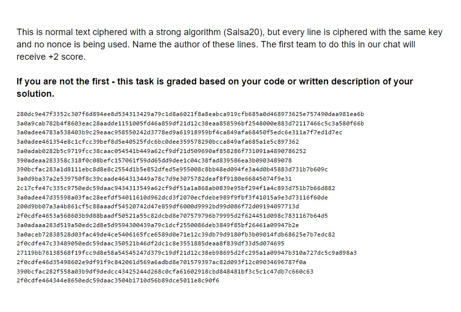
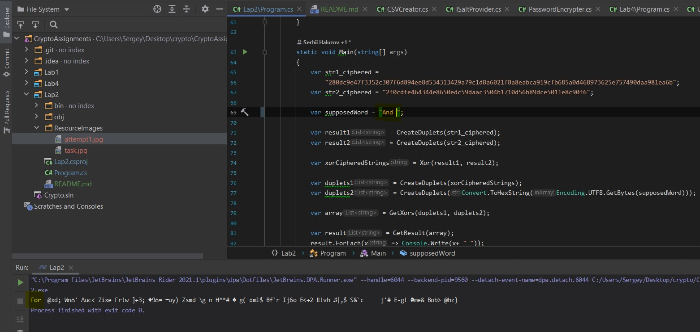
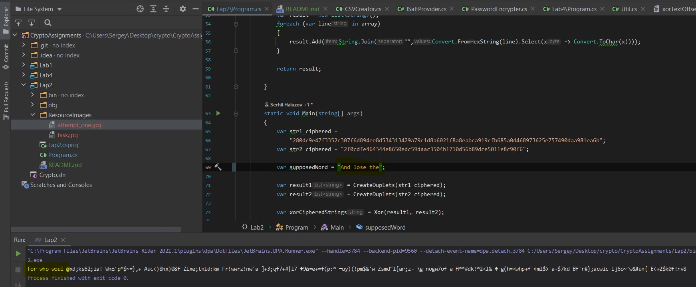
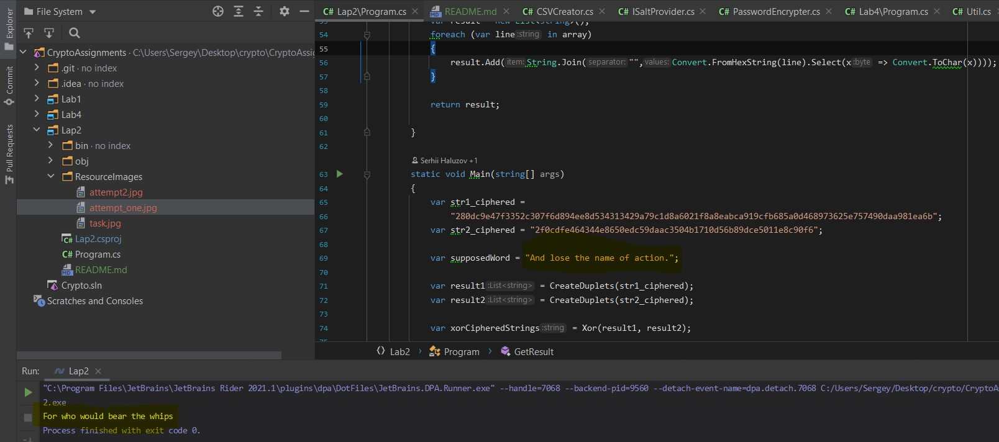

### Lab 2 - One time pad key reuse attack 

In this lab we attack the one time pad encryption technique with the key reuse.
We have the file with messages, each message per file row:

To decipher the messages and get the name of the messages' author
we use the following scheme:

Let's choose two strings from the file. We denote the plain text of message1 will be
M1, the encryption key will be K and the plain text of message2 will be M2.
The ciphered messages with the key K will be C1 and C2 respectively.

We will use following properties:

1) C1 = M1 xor K, C2 = M2 xor K
2) C1 xor C2 = (M1 xor K) xor (M2 xor K) = M1 xor M2

So if we xor two ciphered messages encrypted with the same key, we will get
the xor of the messages' plain texts.

This property we use to attack this kind of encryption. If we guess the part 
of the M1 or M2 and xor this part with the (M1 xor M2), then we get the corresponding part of 
another message's plain text. And in the best attack, if we 
guess, for example M1, we can get the M2:

(M1 xor M2) xor M1 = M2.

#### So to get plain text of some message we:

1. Get some two strings of file as ciphered messages.
2. Split these messages with the duplets of two symbols to get the bytes of messages from the hex format.
3. Xor the bytes in duplets to get the expression C1 xor С2 = M1 xor M2
4. Set the supposed part (P) of the plain text of C1 or C2
5. Convert the P to the hex string
6. Get duplets of bytes of P and (C1 xor C2)
7. Xor duplets of bytes of P and (C1 xor C2)
8. Move the duplets of P consequentially according to the duplets of (C1 xor C2)
9. If we get readable strings, then our supposed part is correct and we can 
move further to decrypt all the message and guess the author of strings.

And the author is William Shakespeare
and the messages are part of "Romeo and Juliette":

